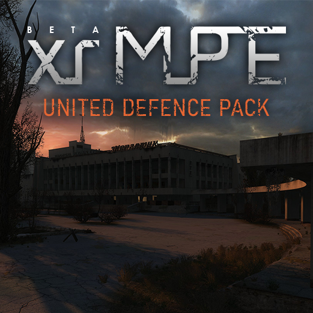

# xrMPE United Defence Pack



## Описание

Аддон для **[X-Ray Multiplayer Extension](https://www.xrmpe.online/)**, объединяющий несколько аддонов в один, с дополнительными правками, улучшениями и контентом.

Актуальный релиз: [**СКАЧАТЬ** 0.5.2](https://github.com/JonnTikhomirov/xrmpe_united_defence_pack/releases/download/v0.5.2/xrMPE_United_Defence_Pack_0.5.2.7z)

## Цели

- реализовать возможность игры с несколькими аддонами на одном сервере
- устранить ошибки и недочеты
- добавить новые функции и контент
- Ориентация на режим **Оборона**
- Развитие стрелкового боя с НПС

---

## Включенные аддоны и моды
- [SevenPack 1.6](https://ap-pro.ru/forums/topic/4177-seven-pack-16/)
  - Уровни: df_arena, df_limansk, df_pripyat, df_escape, df_yantar
  - Динамические объекты
  - Пердметы и сущности
- [DMR Pack](https://ap-pro.ru/forums/topic/4567-dmr-pack-053-dlya-xrmpe/)
  - Уровни: df_mine_coper
  - Погода
- [PVP Pack](https://ap-pro.ru/forums/topic/11997-xrmpe-pvp-addon/)
  - Оружие: ФН 2000, РГ-6, РПК, СР3-М "Вихрь", SR-25
- [Живая зона](https://ap-pro.ru/forums/topic/4023-zhivaya-zona-obt/)
  - Геометрия и текстуры для уровня df_pripyat_center
- Anomaly
  - Скины персонажей, предметов
- [CGIM 2](https://ap-pro.ru/forums/topic/3409-cgim-2/)
- [The Tool](https://www.amk-team.ru/forum/topic/14989-instrument/)

[Подробный changelog](https://github.com/JonnTikhomirov/xrmpe_united_defence_pack/blob/main/CHANGELOG.md)

---

## Принципы

- изменения в текстовых файлах обременяются в блок вида

```ini
; +<АббревиатураАддона> <ОписаниеИзменений>
; исходный текст
новый текст
; -<АббревиатураАддона>
```

- используемые аббревиатуры
  - `UP` - United Defence Pack
  - `UDP` - United Defence Pack
  - `SP` - Seven Pack
  - `DMR` - DMR Pack
  - `PVP` - PvP Addon

## Статус

Аддон на стадии ОБТ.
Состав объединяемых аддонов и набор правок будет расширяться

## Изменения

### Уровни

**Новые уровни:**

- **Центр Припяти** (`df_pripyat_center`) — Монолит защищает ДК "Энергетик" от людей и монстров, в конце предстоит сразится с вертолетом военных. Доступны случайные тайники, зажигаемые костры, любое время суток.
- **Кафе Припять** (`df_pripyat`) — Бандиты защищаются от монстров. Доступны случайные тайники, зажигаемые костры, любое время суток.
- **Лиманск** (`df_limansk`) — Чистое Небо защищаются от монстров. Доступны случайные тайники, зажигаемые костры, любое время суток.
- **Арена** (`df_arena`) — Сталкеры учаcтвуют в договорных боях против разных группировок. Доступны все игровые предметы в ассортименте торговца на старте.
- **Янтарь** (`df_yantar`) — Ученые защищают бункер от зомбированных и монстров, в конце дожидаются вертолета поддержки. Доступны случайные тайники, зажигаемые костры, любое время суток.
- **Блокпост** (`df_escape`) — Военные защищают блокпост от монстров, в конце дожидаются вертолета поддержки. Доступны случайные тайники, ночное освещение, любое время суток.
- **Шахтный копер** (`df_mine_coper`) — Бандиты защищаются от монстров. Доступны случайные тайники, ночное освещение, любое время суток.

**Общие фичи уровней (в т.ч. оригинальных):**

- Динамическая погода, в т.ч. сильный туман и ночь
- Случайное время суток на старте
- Дополнительный лут бронебойных патронов и предметов для ночной игры
- Особая динамическая музыка на финальных волнах

### Геймплей

**Оружие и экипировка:**

- Добавлено оружие:
  - ФН 2000
  - РГ-6
  - РПК
  - СР3-М «Вихрь»
  - SR-25
- Добавлены костюмы:
  - коричневый плащ
  - Боевой прикид "Гоп-Стоп"
  - Боевой прикид "ТАНК"
  - Бронежилет ЧН-4
  - костюм Монолита
  - СЕВА Монолита
  - экзоскелет Монолита
  - ССП-99М (зеленый эколог)
  - экзоскелет Экологов
- Полный ребаланс костюмов и шлемов по пулестойкости
- Ребаланс некоторого оружия

**Механики и пердметы:**

- Осветительные артефакты «Лунный свет» и «Пламя»
- Осветительный флаер
- Автоматическая подмена предметов в слотах быстрого доступа на другие того же класса
- Управляемые костры (постоянные, временные) и спички для розжига
- В меню фраз игроков добавлен Смех
- Бронебойные патроны треперь имеют значение

### ИИ и NPC

- Полный ребаланс зрения НПС и адаптация под погоду
- Полный ребаланс пулестойкости НПС
- Ребаланс и дополнение противников:
  - Сталкеры
  - Бандиты
  - Свобода
  - Долг
  - Наемники
  - Чистое небо
  - Военные
  - Монолит
  - Зомбированные
- Новый класс противников-снайперов
- НПС теперь истекает кровью
- Ребаланс стрельбы вертолета, вертолет может быть союзником

### Техническая часть

**Скрипты и системы:**

- Модуль Remote Command для удалённого администрирования через скрипты
- Система подключаемых рестрикторов логики для любого уровня
- Возможность подсветки лобби в ночное время
- Включение и контроль особой музыки вместо динамической
- Переработан `treasure_manager` — чанковая система, адаптирован под мультиплеер
- Синхронизация состояния вертолета клиент-сервер

**Спавнер (The Tool):**

- Работает через модуль Remote Command
- Регулировка времени суток
- Отключение автосмены погоды
- Режим полёта
- Отключение проверки границ уровня

### Исправления

- Поводыря больше нельзя убить раньше трех фаз регенерации
- Вылеты на звуках НПС
- НПС-противники теперь всегда держат оружие в руках и не подбирают ничего
- Баги со сбросом отношений НПС союзных группировок если они были врагами
- Проверка инфопоршней на клиенте
- Уменьшен урон по голове игрока
- Рестрикторы проверяют наличие только живых игроков
- Бесконечные подствольные гранаты теперь невозможны, так как можно использовать только один вид гранат
- Правильный случайный seed рандомайзера lua на старте игры
- Метариал fake_slide теперь ведет себя так же как и fake, но со скольжением и увеличенным уроном от удара
